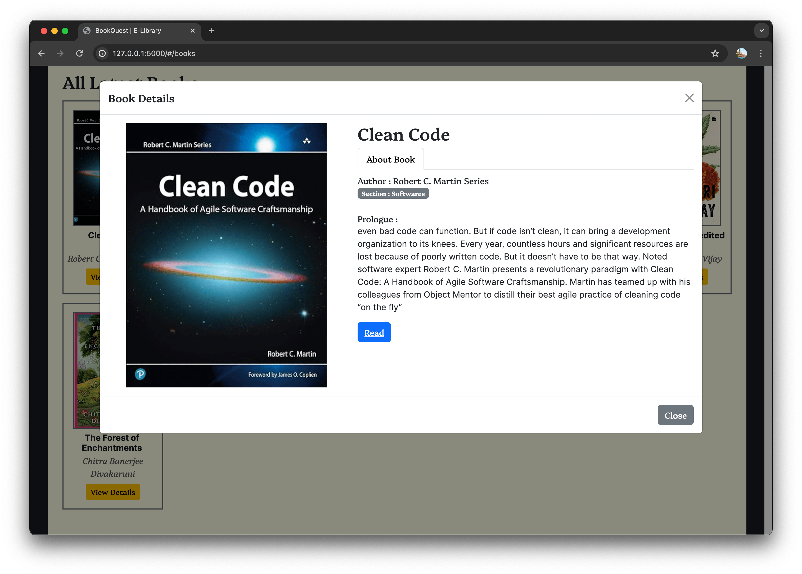
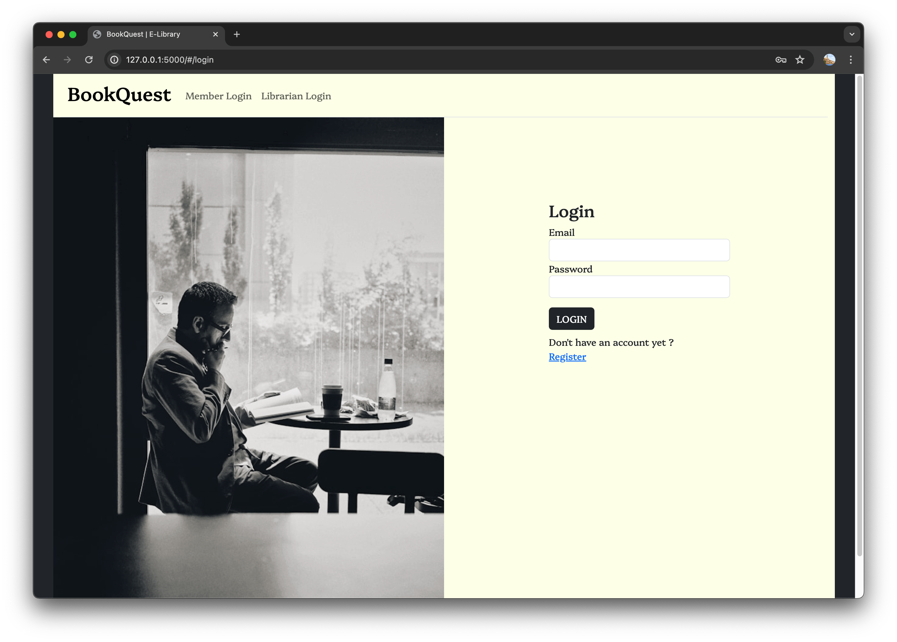
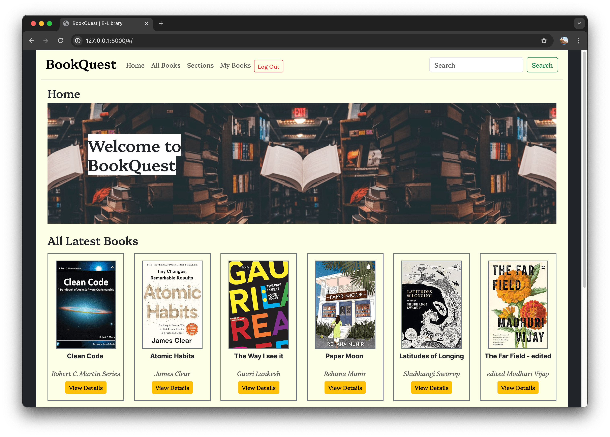
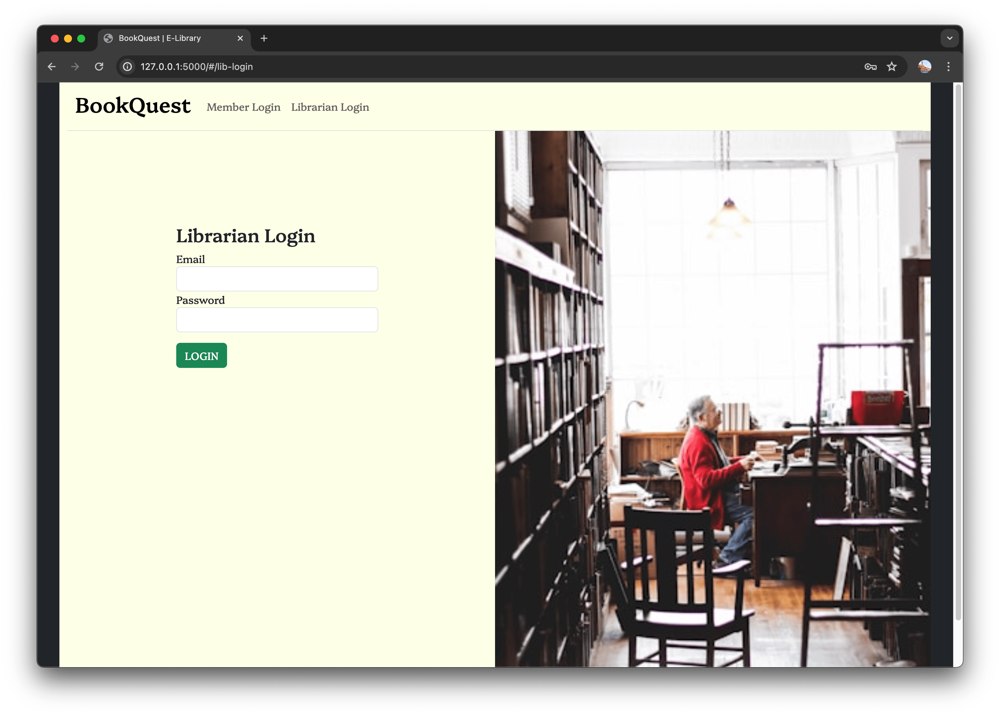
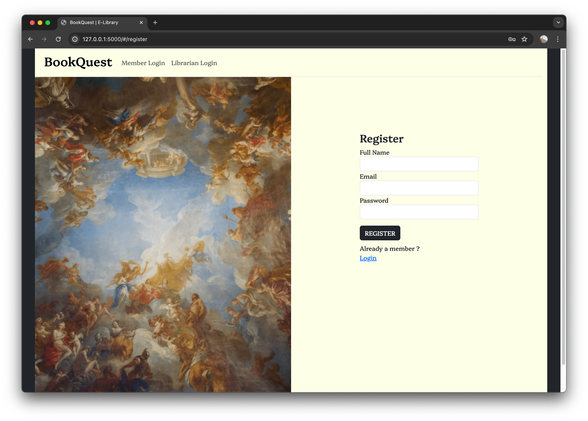

## Library Management System
### Modern Application Development 2 Project 
Author : Salmanul Faris

>**About Application** 
> 
>This is App is developed in flask, vue and Bootstrap 5 as CSS framework, 
>and SQLite as Database.

## Screenshots
<div style="width: 100%;display: inline-block">
   
   
   
   
   
</div>


#### Steps to use application
1. Create Virtual Environment 
  
   ``python -m virtualenv myenv``


2. Activate Virtual Environment
  
   ``source /myenv/bin/activate``


3. Install all required packages for app

    ``pip install -r requirements.txt``


4. Change entry file of flask

      ``export FLASK_APP=main``


5. Start Server
  
    ``flask run --debug``


6. Migrate Data
   
   Go to  ``python3 setup_db.py`` to migrate db and seed basic data 


## Cache Commands
``redis-server``

```celery -A main:celery_app worker --loglevel INFO```

```celery -A main:celery_app beat --loglevel INFO```

